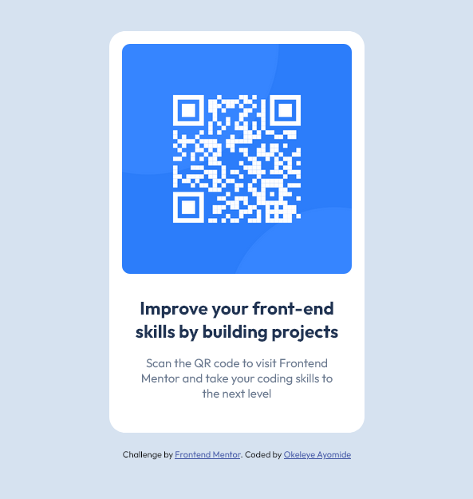

# Frontend Mentor - QR code component solution

This is a solution to the [QR code component challenge on Frontend Mentor](https://www.frontendmentor.io/challenges/qr-code-component-iux_sIO_H). Frontend Mentor challenges help you improve your coding skills by building realistic projects. 

## Table of contents

- [Overview](#overview)
  - [Screenshot](#screenshot)
  - [Links](#links)
- [My process](#my-process)
  - [Built with](#built-with)
  - [What I learned](#what-i-learned)
- [Author](#author)

## Overview

### Screenshot

### Links

- Solution URL: [Add solution URL here](https://github.com/okeleyeayomide08/fem-qr-code-component)
- Live Site URL: [live site URL](https://github.com/okeleyeayomide08/fem-qr-code-component/)

## My process

### Built with

- Semantic HTML5 markup
- CSS custom properties
- Flexbox

### What I learned

Through this I learnt what it means to work with a specific design and also recreating designs.

I learnt a lot from this project actually.

## Author

- Frontend Mentor - [@okeleyeayomide08](https://www.frontendmentor.io/profile/okeleyeayomide08)
- Instragram - [@okeleyeayomide08](https://www.instagram.com/okeleyeayomide08/)

